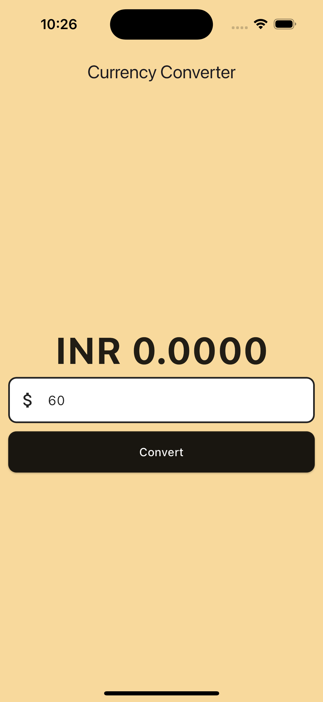

# Currency Converter

This is a simple currency converter application built with Flutter. It allows users to convert an amount from one currency to another.

## Getting Started

This project is a starting point for a Flutter application.

If this is your first Flutter project, here are a few resources to get you started:

- [Lab: Write your first Flutter app](https://docs.flutter.dev/get-started/codelab)
- [Cookbook: Useful Flutter samples](https://docs.flutter.dev/cookbook)

For help getting started with Flutter development, view the
[online documentation](https://docs.flutter.dev/), which offers tutorials,
samples, guidance on mobile development, and a full API reference.

## Features

- Convert currency amounts
- Clean and simple UI
  

## Installation

1. Clone the repo

   ```sh
   git clone https://github.com/your_username_/currency_converter.git

   ```

2. cd currency_converter
3. flutter pub get
4. flutter run

Usage
Enter the amount in the text field and click on the 'Convert' button to convert the currency.

Contributing
Contributions are what make the open-source community such an amazing place to learn, inspire, and create. Any contributions you make are greatly appreciated.

Fork the Project
Create your Feature Branch (git checkout -b feature/AmazingFeature)
Commit your Changes (git commit -m 'Add some AmazingFeature')
Push to the Branch (git push origin feature/AmazingFeature)
Open a Pull Request
License
Distributed under the MIT License. See LICENSE for more information.

Contact
Your Name - lavkushrygmail.com

Project Link: https://github.com/lavkushry/currency_converter
